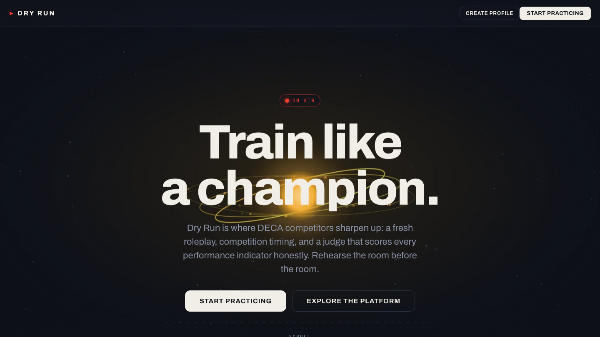
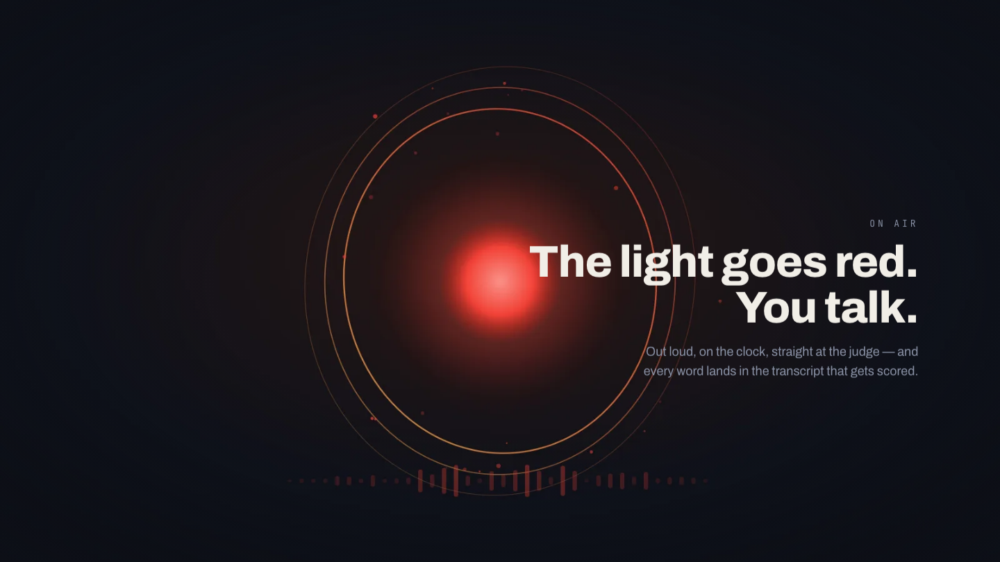
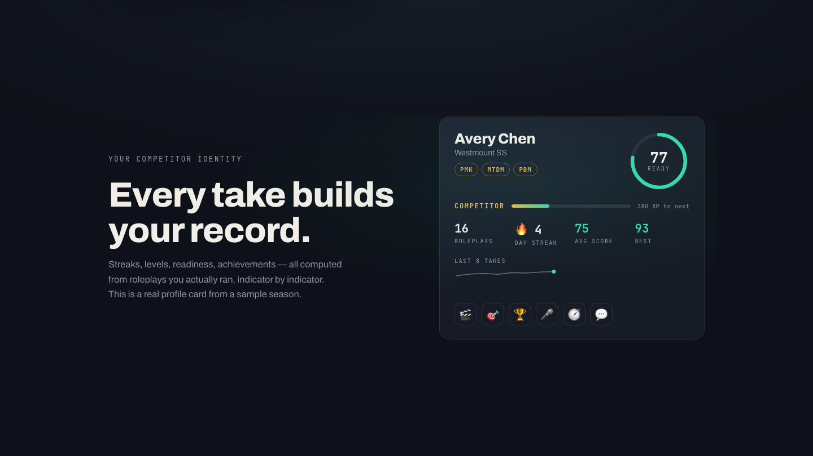

# Dry Run — train like a champion

**The DECA roleplay trainer.** Draw a real event, prep on a competition clock,
present out loud to your browser, and get an honest, indicator-by-indicator
verdict from an AI judge calibrated to the tier you're training for — then
watch your streak, level, and readiness grow from runs you actually did.

Live: **https://dry-run-git-main-tdwseoh12.vercel.app**



## Why it's different

- **It's a simulation, not a quiz.** Real DECA timing (10:00/10:00 individual,
  30:00/15:00 team decision-making), a standby ring with an alarm, a pulsing
  ON AIR tally, live speech-to-text — the pressure is the product.
- **The judge doesn't flatter.** Same scenario, same rubric, live model: a
  specific costed plan scored **85**, a confident but off-topic answer **50**,
  and polished filler **25** — with zero strengths returned for the filler,
  because the rubric forbids inventing praise. The receipts, including raw
  model output, are in **[docs/judge-calibration.md](docs/judge-calibration.md)**;
  reproduce with `npm run test:judge`.
- **Every number is earned.** Streaks, XP levels, achievements, and the
  documented readiness formula all derive from your practice log. There is no
  fake gamification anywhere in the product — showcase sections on the
  marketing page are explicitly labeled demo data.
- **Official-style grading.** Generated scenarios choose their performance
  indicators verbatim from a curated bank of DECA-style PIs per career
  cluster — and uploading the **official event PDF** grades you on its printed
  indicators, extracted entirely in your browser.



## The experience

1. **Draw your event** — nine events across four clusters (PBM, PMK, PFN, PHT,
   HRM + the four team decision-making events), three tiers
   (Regional / Provincial / ICDC). Tier drives scenario complexity, indicator
   count (4/5/7), and how harshly the judge calibrates.
2. **Prep** — the brief, the printed indicators, a scratchpad that follows you
   on air, and a depleting standby ring. Redraw the scenario if you don't like
   the draw. When prep expires, an alarm sounds and you're on automatically.
3. **On air** — speak your take; words stream into the transcript with a live
   HUD (words, wpm with a pace verdict, filler counter). No mic? It falls back
   to typing so the run never dead-ends.
4. **The verdict** — a score per indicator with a grounded justification and
   one concrete fix, strengths / raise-the-score lists, delivery stats, the
   full tape with fillers highlighted, a score-trend sparkline — and then the
   judge looks up and asks **the follow-up question**. Answer it out loud and
   get a scored rebuttal verdict, exactly like the real Q&A.
5. **The record** — a competitor profile (multi-step onboarding, stored
   locally) with streaks, four XP levels, nine derivable achievements, a
   readiness ring, per-event averages, and a downloadable **share card**
   rendered on canvas.



## Architecture

Vite + React 18 + TypeScript SPA, plain CSS (no UI libraries, no animation
libraries — every effect on the page is hand-rolled), with two thin Vercel
serverless functions whose only job is keeping the LLM key server-side.

```
api/
  _lib/config.ts        provider + model switchboard (Gemini native / any OpenAI-compatible)
  _lib/llm.ts           the ONLY reader of LLM_API_KEY; one complete() seam, two transports
  _lib/parse.ts         defensive JSON validation — every model output distrusted, tested
  generate-scenario.ts  event + difficulty + official-PI slate → validated Scenario
  judge.ts              transcript + tier calibration → validated JudgeResult
  rebuttal.ts           the Q&A round → scored rebuttal verdict
src/
  DryRun.tsx            one state machine: home → setup → prep → onair → verdict (+ profile)
  components/           ScrollFilm (89-frame canvas scrub), RunSetup, Profile, Onboarding,
                        QnaRound, CompetitorCard, Tilt/Magnetic/SplitTitle/Ticker (FX kit)…
  prompts/              scenario author, judge rubric, rebuttal — the tuning surfaces
  lib/                  pure, tested: events, indicators (PI bank), profile (streaks/XP/
                        readiness/achievements), trend, delivery, history, demo, sharecard…
scripts/                frame generator (SVG→WebP film), OG-card generator, judge A/B harness
tests/                  99 vitest tests — parsers, handlers (LLM mocked), every derivation
```

Design decisions worth knowing:

- **The landing film** is 89 procedurally generated WebP frames (2.2 MB total)
  scrubbed by scroll position on a sticky canvas — no video tag, no scroll
  library. Frames regenerate with `npm run frames`; the color story follows a
  run: amber standby → red on air → mint verdict.
- **Storage is two modules** (`lib/history.ts`, `lib/profile.ts`) behind pure,
  tested parsers. Swapping localStorage for Supabase means reimplementing those
  two modules; no component touches storage directly.
- **Honest derivations**: the readiness formula (50% recent scoring, 20%
  trajectory, 20% consistency, 10% volume) and every achievement rule are pure
  functions with unit tests — see `tests/profile.test.ts`.
- **Graceful degradation everywhere**: no mic → typed take; malformed model
  JSON → 502 + in-voice retry; unknown difficulty → uncalibrated judging; a
  render crash → styled recovery screen (your data is in localStorage).

## Run it

```bash
npm install
cp .env.example .env      # add LLM_API_KEY (free Gemini key: aistudio.google.com/apikey)
vercel dev                # NOT `vite` — the /api/* functions need the Vercel runtime
```

```bash
npm run typecheck && npm test   # 99 tests, LLM mocked
npm run test:judge              # A/B the judge rubric against the live model
npm run frames && npm run og    # regenerate the film + social card
```

Deploy: import the repo in Vercel, set `LLM_API_KEY`, done. The provider is
switchable in `api/_lib/config.ts` (Gemini native by default; Groq/OpenRouter/
local presets documented in the file).

## Judge-me-quickly mode

On the landing page, scroll to **"Every take builds your record"** and hit
**Explore this dashboard live** — it seeds a labeled sample season so you can
inspect the full competitor dashboard in one click, and *Clear demo* erases it.
The sample data never mixes with real practice data.

## Roadmap

Supabase behind the two storage modules (accounts, sync, live school
leaderboards), official DECA PI datasets per event, richer speech analysis
(pause cadence, question handling), and team mode with a shared prep timer.
